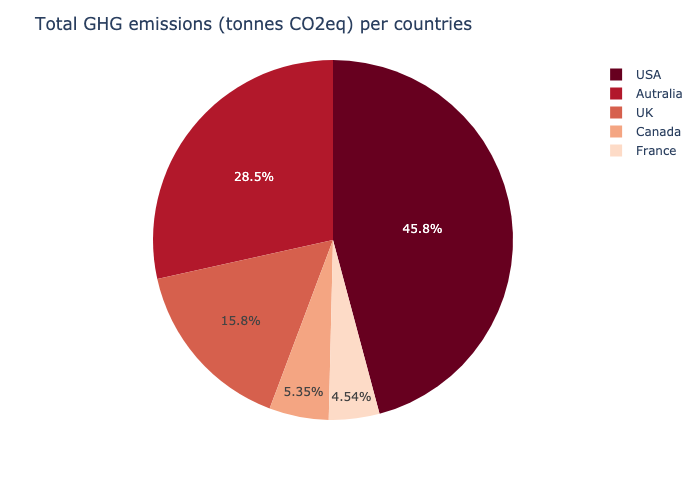
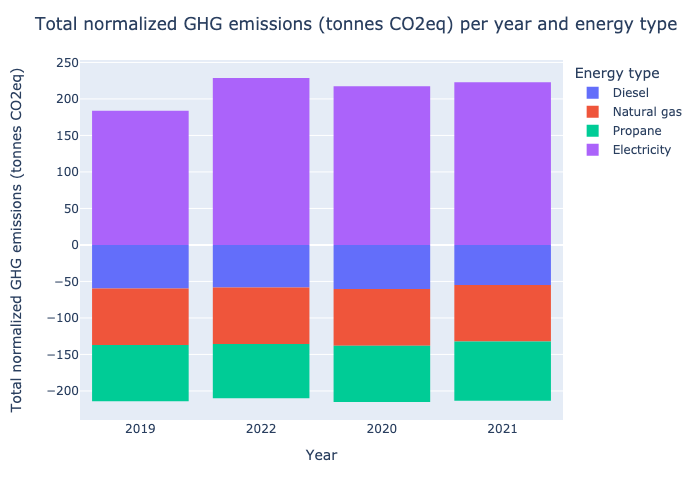

# Greenhouse gas emissions

Data visualization for Global GHG emissions (tonnes CO2eq) by countries and by year and energy type.

# Usage
A brief guide of how to use carbon_footprint :

To run locally you need to activate the environment then run the command line as following : 
    conda env create -f environment_footprint.yml
    conda activate footprint_env
    cd src/
    python main.py

# Docker
If you want to run it though Docker use this command line : 
### Build Docker image then run it
docker build --tag carbon_footprint .
docker container run carbon_footprint:latest

# Algorithm flow
Calculation formula: Total GHG emissions (tCO2eq) = Energy consumption * Emission factors * Global Warming Potential (GWP)
# Output
The output will be display in results folder with two figures GHG emissions based on country and on year/energy type and two html representing the interactive figures.

# Copyright
Yasmine Draceni - October 2023

